# 💸 Expense Tracker - PaisaWaisa

## 🚀 Features

- 🔐 **User Authentication**: Sign up, log in, and log out with protected routes to secure user data.  
- 📊 **Interactive Dashboard**: Visualize income and expenses with dynamic bar charts for better data insights.  
- ➕ **Add Transactions**: Easily add income and expenses to keep track of your financial activities.  
- ❌ **Manage Transactions**: Delete transactions with a simple click.  
- 📥 **Download Reports**: Generate and download detailed income and expense reports for future reference.  
 

## 📸 Screenshots

### 📝 Sign Up & Login

  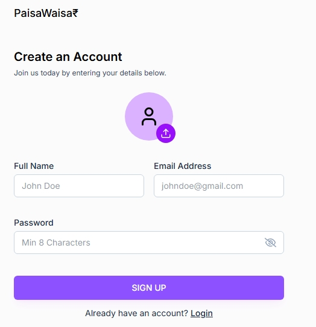
  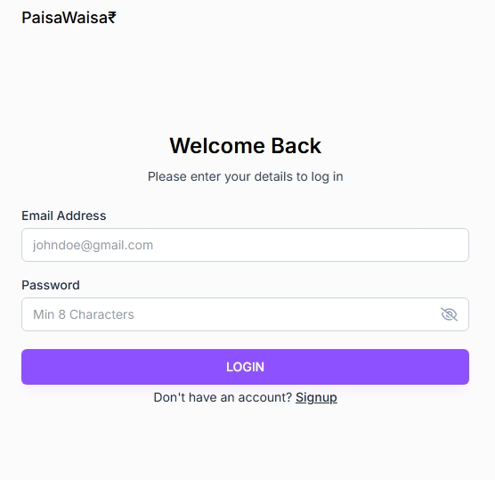

### 📊 Dashboard

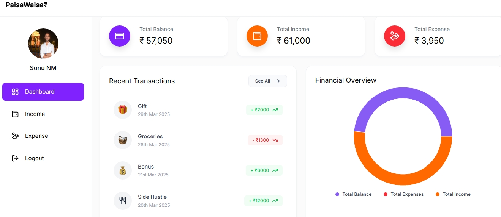  
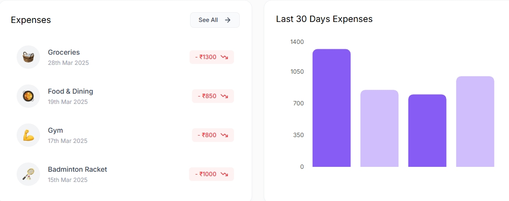  
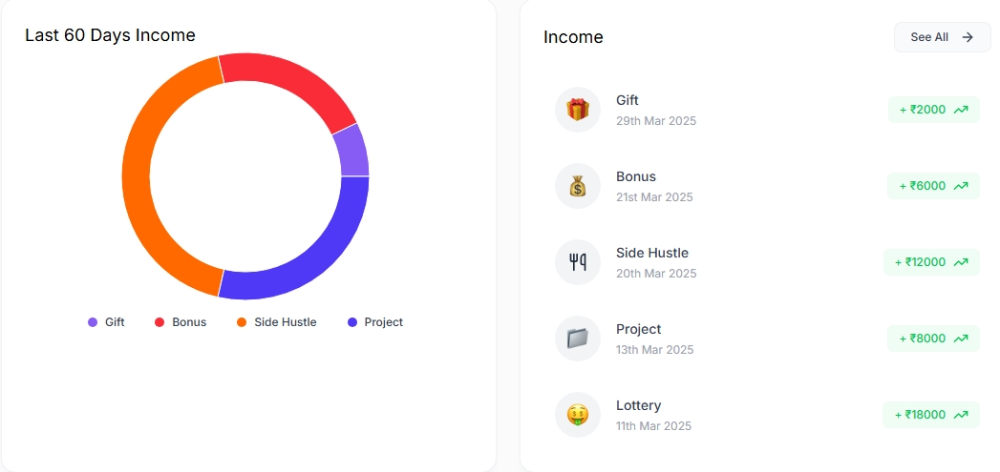  

### 💸 Expenses

  

    

      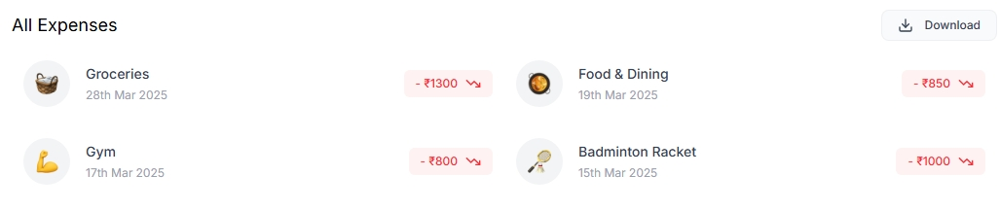
      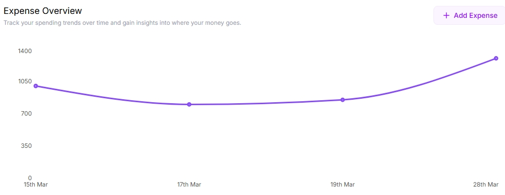
    

    

      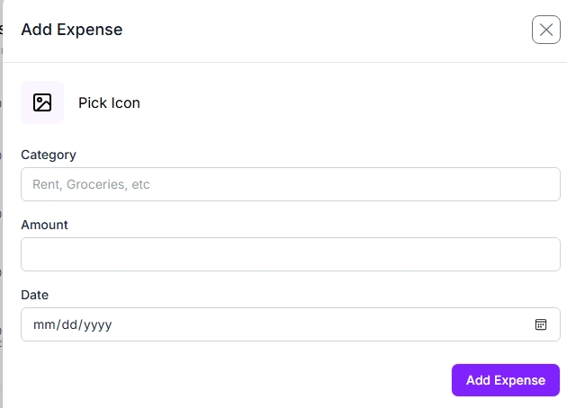
    

  

### 💰 Income

  

    

      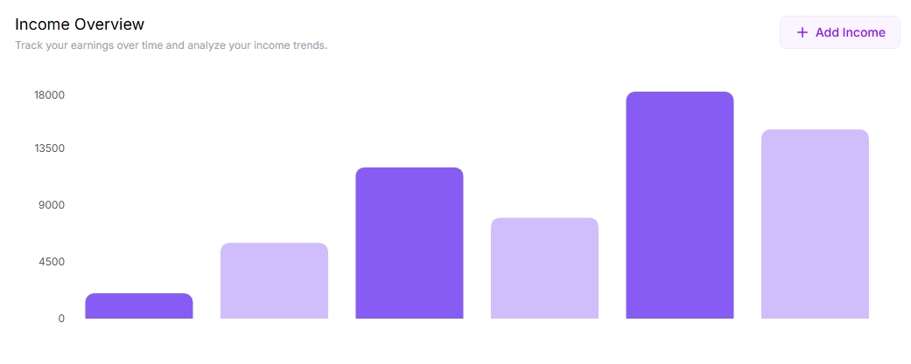
      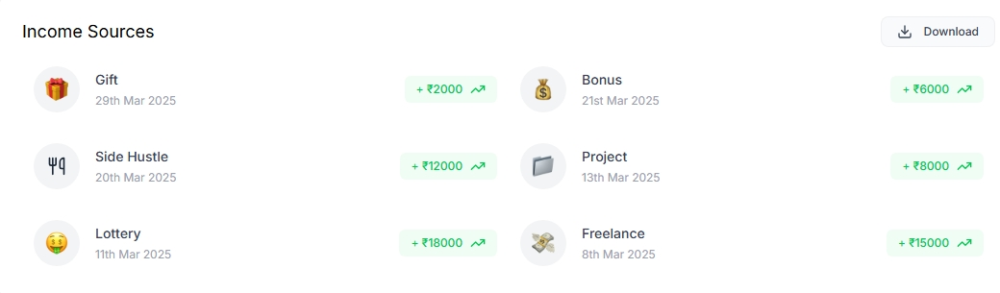
    

    

      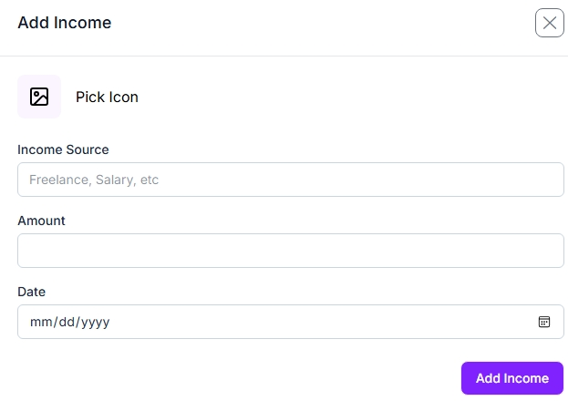
    

  

